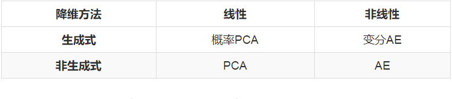

# 概率PCA与变分自编码器VAE

## 1.介绍

主成分分析(PCA)和自编码器(AutoEncoders, AE)是无监督学习中的两种代表性方法。

PCA的地位不必多说，只要是讲到降维的书，一定会把PCA放到最前面，它与LDA同为机器学习中最基础的线性降维算法，SVM/Logistic Regression、PCA/LDA也是最常被拿来作比较的两组算法。

自编码器虽然不像PCA那般在教科书上随处可见，但是在早期被拿来做深度网络的逐层预训练，其地位可见一斑。尽管在ReLU、Dropout等神器出现之后，人们不再使用AutoEncoders来预训练，但它延伸出的稀疏AutoEncoders，降噪AutoEncoders等仍然被广泛用于表示学习。2017年的kaggle比赛“Porto Seguro’s Safe Driver Prediction”的冠军就是使用了降噪AutoEncoders来做表示学习，最终以绝对优势击败了手工特征工程的选手们。

PCA和AutoEncoders都是非概率的方法，它们分别有一种对应的概率形式叫做概率PCA(Probabilistic PCA)和变分自编码器(Variational AE, VAE)，本文的主要目的就是整理一下PCA、概率PCA、AutoEncoders、变分AutoEncoders这四者的关系。

先放结论，后面就围绕这个表格展开：

## 2.降维的线性方法和非线性方法

降维分为线性降维和非线性降维，这是最普遍的分类方法。
PCA和LDA是最常见的线性降维方法，它们按照某种准则为数据集
$\lbrace x_i \rbrace_{i=1}^n$
找到一个最优投影方向
$W$
和截距
$b$
，然后做变换
$z_i = Wx_i+b$
得到降维后的数据集
$\lbrace z_i \rbrace_{i=1}^n$
。因为
$z_i = Wx_i+b$
是一个线性变换（严格来说叫仿射变换，因为有截距项），所以这两种方法叫做线性降维。

非线性降维的两类代表方法是流形降维和AutoEncoders，这两类方法也体现出了两种不同角度的“非线性”。流形方法的非线性体现在它认为数据分布在一个低维流形上，而流形本身就是非线性的，流形降维的代表方法是两篇2000年的scinece论文提出的：多维放缩(multidimensional scaling, MDS)和局部线性嵌入(locally linear embedding, LLE)。（不得不说实在太巧了，两种流形方法发表在同一年的science上）
AutoEncoders的非线性和神经网络的非线性是一回事，都是利用堆叠非线性激活函数来近似任意函数。事实上，AutoEncoders就是一种神经网络，只不过它的输入和输出相同，真正有意义的地方不在于网络的输出，而是在于网络的权重。

## 3. 降维的生成式方法和非生成式方法

### 3.1 两类方法

降维还可以分为生成式方法（概率方法）接非生成式方法（非概率方法）。

教科书对PCA的推导一般是基于最小化重建误差或者最大化可分性的，或者说是通过提取数据集的结构信息来建模一个约束最优化问题来推导的。事实上，PCA还有一种概率形式的推导，那就是概率PCA，PRML里面有对概率PCA的详细讲解，感兴趣的读者可以去阅读。需要注意的是，概率PCA不是PCA的变体，它就是PCA本身，概率PCA是从另一种角度来推导和理解PCA，它把PCA纳入了生成式的框架。

分类中的生成式方法和判别式方法已经为大家所熟知，其实降维中也有生成式方法和非生成式方法。首先来看一下降维问题的形式化描述：

设
$\lbrace x_i \rbrace_{i=1}^n$
是我们拿到的数据集，我们的目的是得到数据集中每个样本的低维表示
$\lbrace z_i \rbrace_{i=1}^n$
，其中
$dim(z_i) < dim(x_i)
$。

降维的生成式方法认为数据集
$\lbrace x_i \rbrace_{i=1}^n$
是对一个随机变量
$x$
的
$n$
次采样，而随机变量
$x$
依赖于随机变量
$z$
，对
$z$
进行建模：

$z \sim p_\theta(z) $

再对这个依赖关系进行建模：

$x|z \sim p_\theta(x|z)$

有了这两个公式，我们就可以表达出随机变量
$x$
的分布：

$x \sim p_\theta(x) = \int_Z p_\theta(x|z)p_\theta(z)dz$

随后我们利用数据集
$\lbrace x_i \rbrace_{i=1}^n$
对分布的参数
$\theta$
进行估计，就得到这几个分布。好了，设定了这么多，可是降维降在哪里了呢，为什么没有看到？？？

回想一下降维的定义：降维就是给定一个高维样本
$x_i$
，给出对应的低维表示
$z_i$
，这恰好就是
$p(z|x)$
的含义！所以我们只要应用Bayes定理求出这个概率即可：

$p_\theta(z|x)=\frac{p_\theta(x|z)p_\theta(z)}{\int_Z p_\theta(x|z)p_\theta(z)dz} $

这样我们就可以得到每个样本点
$x_i$
上的
$z$
的分布
$p(z|x=x_i)
$，可以选择这个分布的峰值点作为
$z_i$
，降维就完成了。

Q：那么问题来了，生成式方法和非生成式方法哪个好呢？  

A：当然是非生成式方法好了，一两行就能设定完，君不见生成式方法你设定了一大段？？？  

↑  

应该会有很多人这样想吧？事实也的确如此，上面这个回答在一定意义上是正确的。如果你只是为了对现有的数据
$\lbrace x_i \rbrace_{i=1}^n$
进行降维，而没有其他需求，那么简单粗暴的非生成式方法当然是更好的选择。

那么，在什么情况下，或者说什么需求下，生成式方法是更好的选择更好呢？答案就蕴含在“生成式”这个名称中：在需要生成新样本的情况下，生成式方法是更好的选择。

### 3.2 生成式方法的应用场景

相似图片生成就是一种最常见的应用场景，现在我们考虑生成MNIST风格的手写体数字。假设
$x_i$
代表一张图片，
$\lbrace x_i \rbrace_{i=1}^n$
是整个MNIST数据集，我们该怎样建模才能生成一张新图片呢？

最容易想到的方法就是：对
$\lbrace x_i \rbrace_{i=1}^n$
进行KDE(核密度估计)得到
$x$
的分布
$p(x)$
，如果顺利的话
$p(x)$
应该是一个10峰分布，一个峰代表一个数字，从对应的峰中采样一个样本
$x^{new}$
，它就代表了相应的数字。

是不是看起来很简单，然而
$x$
的维度太高（等于MNIST的分辨率, 
$28\times28=784$
），每一维中包含的信息又十分有限，直接对
$\lbrace x_i \rbrace_{i=1}^n$
进行KDE完全没有可行性，所以更好的方法是先对数据集进行降维得到
$\lbrace z_i \rbrace_{i=1}^n$
，然后再对
$\lbrace z_i \rbrace_{i=1}^n$
进行KDE，再从
$p(z)$
中采样
$z^{new}$
并通过逆变换得到
$x^{new}$
。

这样做当然也是可以的，但是依然存在严重的问题。上面的方法相当于把新样本生成拆分成了降维、KDE和采样这三个步骤。降维这一步骤可以使用PCA或者AutoEncoders等方法，这一步不会有什么问题。存在严重问题的步骤是KDE和采样。回想一下KDE其实是一种懒惰学习方法，每来一个样本
$x$
，它就会计算一下这个样本和数据集中每一个样本
$x_i$
的核距离
$k(\frac{x-x_i}{h})$
，然后估计出这一点的密度。这就意味着我们需要把
$z$
所属的空间划分成网格，估计每个网格点上的密度，才能近似得到
$p(z)$
，计算复杂度是
$O(n*grid\_scale)$
，而
$grid\_scale$
关于
$z$
的维数是指数级的，这个计算复杂度是十分恐怖的。即使得到了近似的
$p(z)$
，从这样一个没有解析形式的分布中采样也是很困难的，依然只能求助于网格点近似。因此，KDE和采样这两步无论是计算效率还是计算精度都十分堪忧。

这时候就要求助于生成式方法了。注意到生成式方法中建模了
$p_\theta(z)$
和
$p_\theta(x|z)$
，一旦求出了参数
$\theta$
，我们就得到了变量
$z$
的解析形式的分布！只要从
$p_\theta(z)$
中采样出一个
$z^{new}$
，再取
$p_\theta(x|z=z^{new})$
的峰值作为我们的
$x^{new}$
，新样本生成就完成了。

在需要生成新样本时，非生成式方法需要对
$z$
的概率分布进行代价巨大的数值逼近，然后才能从分布中采样；生成式方法本身就对
$z$
的概率分布进行了建模，因此可以直接从分布中进行采样。所以，在需要生成新样本时，生成式方法是更好的选择，甚至是必然的选择。

## 4. （概率）PCA和（变分）AutoEncoders

下面简单整理一下这四种降维方法。注意一些术语，编码=降维，解码=重建，原数据=观测变量，降维后的数据=隐变量。

### 4.1 PCA

原数据：

$x_i \in R^d$

编码后的数据： 

$z_i = W^T(x_i+b) \in R^c$

解码后的数据： 

$\hat{x}_i = Wz_i - b \in R^d$

重建误差：

$\sum_{i=1}^n||x_i - \hat{x}_i||_p^p$

最小化重建误差，就可以得到
$W$
和
$b$
的最优解&解析解，PCA的求解就完成了。

补充说明：

PCA中的
$p=2$
，即最小化二范数意义下的重建误差，如果
$p=1$
的话我们就得到了鲁棒PCA(Robust PCA)。而最小化误差的二范数等价于对高斯噪声的MLE，最小化误差的一范数等价于对拉普拉斯噪声的MLE。因此，PCA其实是在假设存在高斯噪声的条件下对数据集进行重建，这个高斯误差就是我们将要在§4.3的概率PCA中提到的
$\epsilon$
。你看，即使不是概率PCA，其中也隐含着概率的思想。

编码和解码用到的
$W$
和
$b$
是一样的，即编码过程和解码过程是对称的，这一点与下面要讲的AutoEncoders是不同的。

求解上述最优化问题可以得到
$b = - \frac{1}{n}\sum_{i=1}^n x_i$
，这恰好是样本均值的相反数。也就是说，PCA中截距项的含义是让每个样本都减去样本均值，这正是“样本中心化”的含义。既然我们已经知道求出来的截距就是样本均值，所以干脆一开始就对样本进行中心化，这样在使用PCA的时候就可以忽略截距项
$b$
而直接使用
$z_i=W^Tx_i$
，变量就只剩下
$W$
了。教科书上讲解PCA时一般都是上来就说“使用PCA之前需要进行样本中心化”，但是没有人告诉我们为什么要这样做，现在大家应该明白为什么要进行中心化了吧。

### 4.2 AutoEncoders

原数据： 

$x_i \in R^d$

编码后的数据： 

$z_i = \sigma (W^Tx_i+b) \in R^c$

解码后的数据： 

$\hat{x}_i = \hat{\sigma} (\hat{W}z_i+\hat{b}) \in R^d$

重建误差： 

$\sum_{i=1}^n||x_i - \hat{x}_i||_p^p$

最小化重建误差，利用反向传播算法可以得到
$W、b、\hat{W}、\hat{b}$
的局部最优解&数值解，AutoEncoders的求解完成。

补充说明：

这里可以使用任意范数，每一个范数都代表我们对数据的一种不同的假设。为了和PCA对应，我们也取
$p=2$
。
$\sigma (\cdot)$
是非线性激活函数。AutoEncoder一般都会堆叠多层，方便起见我们只写了一层。
$W$
和
$\hat{W}$
完全不是一个东西，这是因为经过非线性变换之后我们已经无法将样本再用原来的基
$W$
进行表示了，必须要重新训练解码的基
$\hat{W}$
。甚至，AutoEncoders的编码器和解码器堆叠的层数都可以不同，例如可以用4层来编码，用3层来解码。

### 4.3 概率PCA

隐变量边缘分布： 

$p(z)=N(z|0,I)$

观测变量条件分布： 

$p_\theta(x|z) = N(x|f(z;\theta), \sigma^2I)$

确定函数： 

$f(z;\theta) = Wz+\mu$

$x$
的生成过程：

$x = Wz + \mu + \epsilon, 其中\epsilon \sim N(0, \sigma^2I)$

因为
$p(z)$
和
$p_\theta(x|z)$
都是高斯分布，且
$p_\theta(x|z)$
的均值
$f(z;\theta) = Wz+\mu$
是
$z$
的线性函数，所以这是一个线性高斯模型。线性高斯模型有一个非常重要的性质：
$p_\theta(x)$
和
$p_\theta(z|x)$
也都是高斯分布！千万不要小瞧这个性质，这个性质保证了我们能够使用极大似然估计或者EM算法来求解PCA。如果没有这个性质的话，我们就只能借助变分法（变分AE采用的）或者对抗训练（GAN采用的）来近似
$p_\theta(x)$
和
$p_\theta(z|x)$
了。有了这个优秀的性质之后，我们至少有三种方法可以求解概率PCA：

$p_\theta(x)=\int_Zp(z)p_\theta(x|z)dz$

是一个形式已知，仅参数未知的高斯分布，因此可以用极大似然估计来求解
$\theta$
。

$p_\theta(z|x)=\frac{p_\theta(x|z)p_\theta(z)}{\int_Z p_\theta(x|z)p_\theta(z)dz} $

也是一个形式已知，仅参数未知的高斯分布，因此可以用EM算法来求解
$\theta$
，顺便还能得到隐变量
$z_i$
。

如果你足够无聊，甚至也可以引入一个变分分布
$q_\phi(z|x)$来求解概率PCA...不过似乎没什么意义，也算是一种方法吧。

一旦求出了
$\theta$
，我们就得到了所有的四个概率：

$p(z)、p_\theta(x|z)、p_\theta(x)、p_\theta(z|x$

有了这四个概率，我们就可以做这些事情了：

1 降维：给定样本
$x_i$
，就得到了分布
$p_\theta(z|x=x_i)$
，取这个分布的峰值点
$z_i$
就是降维后的数据。

2 重建：给定降维后的样本
$z_i$
，就得到了分布
$p_\theta(x|z=z_i)$
，取这个分布的峰值点
$x_i$
就是重建后的数据。

3 生成：从分布
$p(z)$
中采样一个
$z^{new}$
，就得到了分布
$p_\theta(x|z=z^{new})$
，取这个分布的峰值点
$x^{new}$
就是新生成的数据。

4 密度估计：给定样本
$x_i$
，就得到了这一点的概率密度
$p_\theta(x=x_i)$
。

Q1：为什么隐变量要取单位高斯分布（标准正态分布）？

A1：这是两个问题。

subQ1：为什么要取高斯分布？

subA1：为了求解方便，如果不取高斯分布，那么
$p_\theta(x)$
有很大的可能没有解析解，这会给求解带来很大的麻烦。还有一个原因，回想生成新样本的过程，要首先从
$p(z)$
中采样一个
$z^{new}$
，高斯分布采样简单。

subQ2：为什么是零均值单位方差的？

subA2：完全可以取任意均值和方差，但是我们要将
$p(z)$
和
$p_\theta(x|z)$
相乘，均值和方差部分可以挪到
$f(z;\theta)$
中，所以
$p(z)$
的均值和方差取多少都无所谓，方便起见就取单位均值方差了。

Q2：
$p_\theta(x|z)$
为什么选择了高斯分布呢？

A2：因为简单，和上一个问题的一样。还有一个直觉的解释是
$p_\theta(x|z)$
认为
$x$
是由
$f(z:\theta)$
和噪声
$\epsilon$
加和而成的，如果
$\epsilon$
是高斯分布的话，恰好和PCA的二范数重建误差相对应，这也算是一个佐证吧。

Q3：
$p_\theta(x|z)$
的方差为什么选择了各向同性的
$\sigma^2I$
而不是更一般的
$\Sigma$
呢？

A3：方差可以选择一般的
$\Sigma$
，但是
$d^2$
个参数一定会给求解带来困难，所导出的方法虽然也是线性降维，但它已经不是PCA了，而是另外的方法（我也不知道是什么方法）。方差也可以选择成一个的各向异性的对角阵
$\Lambda$
，这样只有
$d$
个参数，事实上这就是因子分析，另一种线性降维方法。只有当方差选择成各向同性的对角阵
$\sigma^2I$
时，导出来的方法才叫主成分分析，这个地方PRML里有介绍。

### 4.4 变分AutoEncoders

隐变量边缘分布： 

$p(z)=N(z|0,I)$

观测变量条件分布：

$p_\theta(x|z)=N(x|f(z;\theta), \sigma^2I)$

确定函数： 

$f(z;\theta)=\sigma(Wz+\mu) $

$x$
的生成过程：

$x= f(z;\theta) + \epsilon, 其中\epsilon \sim N(0,\sigma^2I)$

因为
$f(z;\theta)$
是
$z$
的非线性函数，所以这不再是一个线性高斯模型。观测变量的边缘分布：

$p_\theta(x) = \int_Zp(z)p_\theta(x|z)dz$

没有解析形式。这就意味着我们无法直接使用极大似然估计来求解参数
$\theta$
。更加绝望的是，隐变量的后验分布：

$p_\theta(z|x)=\frac{p_\theta(x|z)p_\theta(z)}{\int_Z p_\theta(x|z)p_\theta(z)dz}$

也没有解析形式（这是当然，因为分母没有解析形式了）。这就意味着我们也无法通过EM算法来估计参数和求解隐变量。

那么，建出来的模型该怎么求解呢？这就需要上变分推断(Variational Inference)，又称变分贝叶斯(Variational Bayes)了。本文不打算细讲变分推断，仅仅讲一下大致的流程。

变分推断会引入一个变分分布
$q_\phi(z|x)$
来近似没有解析形式的后验概率
$p_\theta(z|x)$
。在变分AE的原文中，作者使用了SGD来同时优化参数
$\theta$
和
$\phi$
。一旦求出了这两个参数就可以得到这些概率：

$p(z)、p_\theta(x|z)、q_\phi(z|x)$

注意因为
$p_\theta(x)$
和
$p_\theta(z|x)$
没有解析形式，所以即使求出了
$\theta$
我们也无法获得这两个概率。但是，正如上面说的，
$q_\phi(z|x)$
就是
$p_\theta(z|x)$
的近似，所以需要用
$p_\theta(z|x)$
的地方都可以用
$q_\phi(z|x) $
代替。

有了这三个概率，我们就可以做这些事情了：

1 降维：给定样本
$x_i$
，就得到了分布
$q_\phi(z|x=x_i)$
，取这个分布的峰值点
$z_i$
就是降维后的数据。

2 重建：给定降维后的样本
$z_i$
，就得到了分布
$p_\theta(x|z=z_i)$
，取这个分布的峰值点
$x_i$
就是重建后的数据。

3 生成：从分布
$p(z)$
中采样一个
$z^{new}$
，就得到了分布
$p_\theta(x|z=z^{new})$
，取这个分布的峰值点
$x^{new}$
就是新生成的数据。

与概率PCA不同的是，这里无法解析地得到
$p_\theta(x_i)$
，进行密度估计需要进行另外的设计，通过采样得到，计算代价还是比较大的，具体步骤变分AE的原文中有介绍。

AutoEncoders只能做到1和2，对3无力。

### 4.5 对比

1 从§4.1和§4.2可以看出，PCA实际上就是线性Autoencoders。两者无论是编码解码形式还是重建误差形式都完全一致，只有是否线性的区别。线性与否给优化求解带来了不同性质：PCA可以直接得到最优的解析解，而AutoEncoders只能通过反向传播得到局部最优的数值解。

2 从§4.3和§4.4可以看出，概率PCA和变分AutoEncoders的唯一区别就是
$f(z;\theta)$
是否是
$z$
的线性函数，但是这个区别给优化求解带来了巨大的影响。在概率PCA中，
$f(z;\theta)$
是线性的，所以我们得到了一个线性高斯模型，线性高斯模型的优秀性质是牵扯到的4个概率都是高斯分布，所以我们可以直接给出边缘分布和编码分布的解析形式，极大似然估计和EM算法都可以使用，一切处理都非常方便。在变分AutoEncoders中，
$f(z;\theta)$
是非线性的，所以边缘分布
$p_\theta(x)=\int_Zp(z)p_\theta(x|z)dz$
不再有解析形式，极大似然估计无法使用；编码分布
$p_\theta(z|x)=p_\theta(x,z)/ p_\theta(x)$
也不再有解析形式，EM算法无法使用，我们只能求助于变分推断，得到编码分布的近似
$q_\phi(z|x)$
，再利用别的技巧得到边缘分布
$p_\theta(x)$
的估计。

3 从§4.1和§4.3可以看出，PCA和概率PCA中
$x$
都是
$z$
的线性函数，只不过概率PCA显式地把高斯噪声
$\epsilon$
写在了表达式中；PCA没有显式写出噪声，而是把高斯噪声隐含在了二范数重建误差中。

4 从§4.2和§4.4可以看出，AE和VAE的最重要的区别在于VAE迫使隐变量
$z$
满足高斯分布
$p(z)=N(z|0,I)$
，而AE对
$z$
的分布没有做任何假设。这个区别使得在生成新样本时，AE需要先数值拟合
$p(z)$
，才能生成符合数据集分布的隐变量，而VAE直接从
$N(z|0,I)$
中采样一个
$z$
，它天然就符合数据集分布。事实上，这是因为在使用变分推断进行优化时，VAE迫使
$z$
的分布向
$N(z|0,I)$
靠近，不过本文中没有讲优化细节，VAE的原文中有详细的解释。

## 5. 总结

本文将降维按照是否线性、是否生成式划分，将PCA、概率PCA、AutoEncoders和变分AutoEncoders纳入了这个划分框架中，并分析了四种算法的内在联系。
