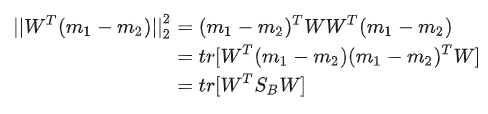

# 教科书上的LDA为什么长这个样子？

线性判别分析(Linear Discriminant Analysis, LDA)是一种有监督降维方法，有关机器学习的书上一定少不了对PCA和LDA这两个算法的介绍。LDA的标准建模形式是这样的（这里以两类版本为例，文章会在几个关键点上讨论多类情况）：

$\max\limits_w \quad \frac{w^TS_Bw}{w^TS_Ww}$

其中， 
$S_B$
是类间散布矩阵， 
$S_W$
是类内散布矩阵， 
$w$
是投影直线:

$S_B = (m_1 - m_2)(m_1 - m_2)^T, \quad S_W = S_1 + S_2, \quad w \in R^d $

怎么样，一定非常熟悉吧，经典的LDA就是长这个样子的。这个式子的目标也十分直观：将两类样本投影到一条**直线**上，使得投影后的类间散布**矩阵**与类内散布矩阵的**比值**最大。

三个加粗的词隐含着三个问题：

1 为什么是类间散布矩阵 
$(m_1-m_2)(m_1-m_2)^T$
呢？直接均值之差 
$m_1-m_2$
不是更符合直觉吗？这样求出来的解和原来一样吗？

2 为什么是投影到直线，而不是投影到超平面？PCA是把d维样本投影到c维(c<d)，LDA为什么不能也投影到c维，而是直接投影到1维呢？同样地，在K类LDA中，为什么书上写的都是投影到K-1维，再高一点不行吗？这是必然吗？

3 为什么是类间散布与类内散布的比值呢？差值不行吗？

这篇文章就围绕这三个问题展开。我们先回顾一下经典LDA的求解，然后顺次讲解分析这三个问题。

# 0. 回顾经典LDA：

原问题等价于这个形式：

$\max \limits_w \quad w^TS_Bw \\ \qquad s.t. \quad w^TS_Ww = 1$

然后就可以用拉格朗日乘子法了：

$L(w,\lambda)=-w^TS_Bw+\lambda(w^TS_Ww-1) $

求导并令其为0：

$\partial_w L(w,\lambda) = -2S_Bw+2\lambda S_Ww=0 $

得到解：

$S_W^{-1}S_Bw=\lambda w $

对矩阵 
$S_W^{-1}S_B$
进行特征值分解就可以得到w。但是有更简单的解法：

$S_W^{-1}(m_1-m_2)(m_1-m_2)^Tw=\lambda w $

而其中 
$(m_1-m_2)^Tw$
是一个标量，所以 
$S_W^{-1}(m_1-m_2)$
和 
$\lambda w$
共线，得到：

$w \propto S_W^{-1}(m_1-m_2) $

求解完毕。

非常优雅，不愧是教科书级别的经典算法，整个求解一气呵成，标准的拉格朗日乘子法。但是求解中还是用到了一个小技巧： 
$(m_1-m_2)^Tw$
是标量，从而可以免去特征值分解的麻烦。那么，我们能不能再贪心一点，找到一种连这个小技巧都不需要的求解方法呢？答案是可以，上面的问题(1)就是在做这个事情。

# 1. 类间散布&均值之差

我们不用类内散布矩阵了 
$(m_1-m_2)(m_1-m_2)^T$
，改用均值之差 
$m_1-m_2$
这个更符合直觉的东西：

$\quad \max \limits_w \quad w^T(m_1-m_2) \\ s.t. \quad w^TS_Ww = 1$

还是用拉格朗日乘子法：

$L(w,\lambda)=-w^T(m_1-m_2)+\lambda(w^TS_Ww-1) $

求导并令其为0：

$\partial_w L(w,\lambda) = -(m_1-m_2)+2\lambda S_Ww=0 $

得到解：

$w \propto S_W^{-1}(m_1-m_2) $

怎么样，是不是求解更简单了呢，不需要任何技巧，一步一步下来就好了。

为什么说均值之差更符合直觉呢？大家想啊，LDA的目的是让投影后的两类之间离得更远，类内离得更近。说到类内离得更近能想到的最直接的方法就是让类内方差最小，这正是类内散布矩阵；说到类间离得更远能想到的最直接的方法肯定是让均值之差最大，而不是均值之差与自己的克罗内克积这个奇怪的东西最大。

那么经典LDA为什么会用类间散布矩阵呢？我个人认为是这样的表达式看起来更加优雅：分子分母是齐次的，并且这个东西恰好就是广义瑞利商：

$\frac{x^TAx}{x^TBx} $

虽然经典LDA求解没有上面这个方法直接，但是问题表述更加规范，所用到的技巧也非常简单，不会给是使用者带来困扰，所以LDA最终采用的就是类间散布矩阵了吧。

# 2. 直线&超平面

上面那个问题只算是小打小闹，没有太大的意义，但是这个问题就很有意义了：LDA为什么直接投影到直线（一维），而不能像PCA一样投影到超平面（多维）呢？

我们试试不就完了hhh。

假设将样本投影到 
$W = (w_1, w_2, ..., w_c)\in R^{d \times c}$
上，其中每一个 
$w_i$
都是经典LDA中的 
$w$
。也就相当于我们不是把样本投影到一条直线上，而是投影到c条直线上，也就相当于投影到了超平面上。投影后的样本坐标为：

$W^Tx = \left[ \begin{matrix} w_1^Tx \\ w_2^Tx \\ . \\ . \\ w_c^Tx \end{matrix} \right] \in R^c $

*Github无法渲染上述公式，所以附图。本地markdown编辑器一般都可以打开*

所以样本的投影过程就是：

$x\Rightarrow W^Tx $

那么，均值的投影过程也是这样：

$m_1\Rightarrow W^Tm_1 \\ m_2\Rightarrow W^Tm_2$

投影后的均值之差的二范数：

$\begin{equation} \begin{aligned} ||W^T(m_1-m_2)||_2^2 &=(m_1-m_2)^TWW^T(m_1-m_2) \\ &=tr[W^T(m_1-m_2)(m_1-m_2)^TW] \\ &=tr[W^TS_BW] \end{aligned} \end{equation} $

*Github无法渲染上述公式，所以附图。本地markdown编辑器一般都可以打开*

为什么不用第一行的向量内积而偏要用第二行的迹运算呢？因为这样可以拼凑出类间散布 
$(m_1-m_2)(m_1-m_2)^T$
来，和经典LDA保持形式的一致。

回顾一下经典LDA的形式：

$\max \limits_w \quad w^TS_Bw \\ \qquad s.t. \quad w^TS_Ww = 1$

现在我们有了 
$tr[W^TS_BW]$
，还缺个约束，类比一下就可以得到 
$tr[W^TS_WW]$
了： 

$\max \limits_W \quad tr[W^TS_BW] \\ \qquad s.t. \quad tr[W^TS_WW] = 1$

实际上，约束也可以选择成 
$W^TS_WW = I_c$
，这两个约束实际上都是在限制W的解空间，得出来的解是等价的，这两个约束有什么区别呢？我只发现了一点：

回想 
$W = (w_1, w_2, ..., w_c)\in R^{d \times c}$
是c条投影直线，为了确保向这c条直线投影能等价于向c维子空间投影，我们需要保证c条直线是线性无关的，即 
$rank(W) =c$
。看一下约束：

$W^TS_WW = I_c $

右边是秩为c的单位矩阵，因为矩阵乘积的秩不大于每一个矩阵的秩，所以左边这三个矩阵的秩都要不小于c，因此我们得到了 
$rank(W) = c$
。也就是说， 
$W^TS_WW = I_c $
能够保证我们在向一个c维子空间投影。而约束 
$tr[W^TS_WW] = 1$
中没有显式地表达这一点。我对矩阵的理解还不够深入，不知道 
$tr[W^TS_WW] = 1$
是否也隐含了对秩的约束，所以为了保险起见，我选择了带有显式秩约束的 
$W^TS_WW = I_c$
，这样就得到了我们的高维投影版LDA：

$\max \limits_W \quad tr[W^TS_BW] \\ \quad s.t. \quad W^TS_WW = I_c $

下面来求解这个问题。还是拉格朗日乘子法：

$L(W,\Lambda) = -tr[W^TS_BW] + tr[\Lambda^T(W^TS_WW-I_c)] $

求导并令其为0：

$\partial_W L(W,\Lambda) = -2S_BW + 2S_WW\Lambda = 0 $

得到了：

$S_BW = S_WW\Lambda $

在大部分情况下，一些协方差矩阵的和 
$S_W$
是可逆的。即使不可逆，上面这个也可以用广义特征值问题的方法来求解，但是这里方便起见我们认为 
$S_W$
可逆：

$S_W^{-1}S_BW = W\Lambda $

我们只要对 
$S_W^{-1}S_B$
进行特征值分解，就可以得到d个特征向量了，挑出最大特征值对应的c个特征向量来组成W，我们不就得到向c维子空间的投影了吗？！

真的是这样吗？

不是这样的。诚然，我们可以选出c个特征向量，但是其中只有1个特征向量真正是我们想要的，另外c-1个没有意义。

观察：

$S_W^{-1}S_B = S_W^{-1}(m_1-m_2)(m_1-m_2)^T $

发现了吗？等式右边的 
$(m_1-m_2)$
是一个向量，换句话说，是一个秩为1的矩阵。那么，这个乘积的秩也不能大于1，并且它不是0矩阵，所以 

$rank(S_W^{-1}S_B ) = 1 $

秩为1的矩阵只有1个非零特征值，也只有1个非零特征值对应的特征向量w。

可能有人会问了，那不是还有零特征值对应的特征向量吗，用它们不行吗？

不行。来看一下目标函数：

$\max \limits_W \quad tr[W^TS_BW] $

我们刚才得到的最优性条件：

$S_BW = S_WW\Lambda $

所以目标函数为：

$\begin{equation} \begin{aligned} \max \limits_W \quad tr[W^TS_BW] &= \max \limits_W \quad tr[W^TS_WW\Lambda] \\ &= \max \limits_W \quad tr[I_c\Lambda] \\ &= \max \limits_W \quad tr[\Lambda] \\ &= \max \limits_W \quad \lambda_1 + \lambda_2 + ... + \lambda_d \end{aligned} \end{equation}$

*Github无法渲染上述公式，所以附图。本地markdown编辑器一般都可以打开*

而我们的W只能保证 
$\lambda_1, \lambda_2, ..., \lambda_d$
中的一个非零，无论我们怎么选取剩下的c-1个w，目标函数也不会再增大了，因为唯一一个非零特征值对应的特征向量已经被选走了。

所以，两类LDA只能向一条直线投影。

这里顺便解释一下K类LDA为什么只能投影到K-1维，其实道理是一样的。K类LDA的类间散布矩阵是：

$S_B=\sum_{k=1}^KN_k(m_k-m)(m_k-m)^T $

可以看出， 
$S_B$
是K个秩一矩阵 
$(m_k-m)(m_k-m)^T$
的和（因为 
$m_k-m$
是秩一的向量），所以它的秩最大为K。并且
$Nm = N_1m_1 + N_2m_2 + ... + N_km_k$
，所以这K项中有一项可以被线性表出。所以， 
$S_B$
的秩最大为K-1。也即：

$rank(S_W^{-1}B_W) = K-1 $

只有K-1个非零特征值。所以，K类LDA最高只能投影到K-1维。

咦？刚才第三个问题怎么提的来着，可不可以不用比值用差值，用差值的话会不会解决这个投影维数的限制呢？

# 3. 比值&差值

经典LDA的目标函数是投影后的类间散布与类内散布的比值，我们很自然地就会想，为什么非得用比值呢，差值有什么不妥吗？

再试试不就完了hhh。

注意，这一节我们不用向量w，而使用矩阵W来讨论，这也就意味着我们实际上在同时讨论二类LDA和多类LDA，只要把 
$S_B$
和 
$S_W$
换成对应的就好了。

$\max \limits_W \quad tr[W^TS_BW] - \alpha tr[W^TS_WW]$

注意到可以通过放缩W来得到任意大的目标函数，所以我们要对W的规模进行限制，同时也进行秩限制：

$W^TW=I_c $

也就得到了差值版的LDA：

$\max \limits_W \quad tr[W^TS_BW] - \alpha tr[W^TS_WW]\\ s.t. \quad W^TW=I_c \qquad \qquad \qquad \qquad $

依然拉格朗日乘子法：

$L(W, \Lambda) = -tr[W^TS_BW]+\alpha tr[W^TS_WW] + tr[\Lambda^T(W^TW-I_c)] $

求导并令其为0：

$\partial_W L(W,\Lambda) = -2S_BW + 2\alpha S_WW+2W\Lambda = 0 $

得到了：

$S_BW =\alpha S_WW+W\Lambda $

由
$W^TW=I_c$
，有：

$S_BW =\alpha S_WW+W\Lambda W^TW $

可以得到：

$S_BW=(\alpha S_W+W\Lambda W^T)W $

若括号内的东西可逆，则上式可以写为：

$(\alpha S_W+W\Lambda W^T)^{-1}S_BW=W $

注意到， 
$S_B$
的秩不大于K-1，说明等号左边的秩不大于K-1，那么等号右边的秩也不大于K-1，即

$rank(W) <= K-1 $

所以我们还是会遇到秩不足，无法求出K-1个以上的非零特征值和对应的特征向量。这样还不够，我们还需要证明的一点是，新的目标函数在零特征值对应的特征向量下依然不会增加。

目标函数（稍加变形）为：

$\max \limits_W \quad tr[W^T(S_B-\alpha S_W)W] $

再利用刚才我们得到的最优性条件（稍加变形）：

$(S_B -\alpha S_W)W=W\Lambda $

所以目标函数为：

$\begin{equation} \begin{aligned} \max \limits_W \quad tr[W^T(S_B-\alpha S_W)W] &= \max \limits_W \quad tr[W^TW\Lambda] \\ &= \max \limits_W \quad tr[I_c\Lambda] \\ &= \max \limits_W \quad tr[\Lambda] \\ &= \max \limits_W \quad \lambda_1 + \lambda_2 + ... + \lambda_d \end{aligned} \end{equation}$

*Github无法渲染上述公式，所以附图。本地markdown编辑器一般都可以打开*

结论没有变化，新的目标函数依然无法在零特征值的特征向量下增大。

综合新矩阵依然秩不足和零特征值依然对新目标函数无贡献这两点，我们可以得到一个结论：用差值代替比值也是可以求解的，但是我们不会因此受益。

既然比值和差值算出来的解性质都一样，那么为什么经典LDA采用的是比值而不是差值呢？

我个人认为，这可能是因为比值算出来的解还有别的直觉解释，而差值的可能没有，所以显得更优雅一些。什么直觉解释呢？

在二分类问题下，经典LDA是最小平方误差准则的一个特例。若让第一类的样本的输出值等于 
$N/N_1$
，第二类样本的输出值等于 
$-N/N_2$
， 
$N$
代表相应类样本的数量，然后用最小平方误差准则求解这个模型，得到的解恰好是（用比值的）LDA的解。这个部分PRML上有讲解。

# 4. 总结

这篇文章针对教科书上LDA的目标函数抛出了三个问题，并做了相应解答，在这个过程中一步一步深入理解LDA。

第一个问题：可不可以用均值之差而不是类间散布。

答案：可以，这样做更符合直觉，并且更容易求解。但是采用类间散布的话可以把LDA的目标函数表达成广义瑞利商，并且上下齐次更加合理。可能是因为这些原因，经典LDA最终选择了类间散布。

第二个问题：可不可以把K类LDA投影到大于K-1维的子空间中。

答案：不可以，因为类间散布矩阵的秩不足。K类LDA只能找到K-1个使目标函数增大的特征值对应的特征向量，即使选择了其他特征向量，我们也无法因此受益。

第三个问题：可不可以用类间散布与类内散布的差值，而不是比值。

答案：可以，在新准则下可以得到新的最优解，但是我们无法因此受益，K类LDA还是只能投影到K-1维空间中。差值版LDA与比值版LDA相比还缺少了一个直觉解释，可能是因为这些原因，经典LDA最终选择了比值。

所以，教科书版LDA如此经典是有原因的，它在各个方面符合了人们的直觉，本文针对它提出的三个问题都没有充分的理由驳倒它，经典果然是经典。