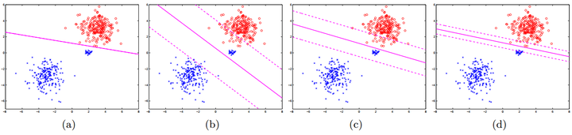

# 感知机（perceptron）和支持向量机（svm）是一种东西吗？ 如果不是那他们的区别和关系是什么？

明白了这个问题就可以从直觉上理解SVM为什么会产生大间隔。

1. 普通的感知器不能产生大间隔(margin)，而SVM可以，所以这两个肯定不是一个东西。
2. 带margin的感知器可以通过两种手段产生大间隔：一种是早停，另一种是加正则化项。
3. 加入了L2正则化项的带 margin的感知器就是SVM。

大家都知道，感知器是不能产生大间隔的，因为它只以分对为目的，不关心分界面离数据点有多远，从它的目标函数很容易看出来（这里直接搬了 @猪猪专业户 的公式），它公平对待每一个数据：

$\min_{w,b}\frac{1}{n}\sum_{i=1}^n max(0, -y_i(w^Tx_i+b))$  (1)

带margin的感知器是这样的，只改动了一个地方：

$\min_{w,b}\frac{1}{n}\sum_{i=1}^n max(0, 1-y_i(w^Tx_i+b))$ (2)

有没有发现，损失函数就是hinge loss，这个改进使得感知器具备了产生大间隔的潜质，因为hinge loss有一段平坦区，允许平坦区内的点被分错，这样就可以撑起来一个管道（类似于SVM）。

虽然带margin的感知器有了hinge loss，但是它依然不能产生大间隔，看下面这个目标函数：

$\min_{w,b}\frac{1}{n}\sum_{i=1}^n max(0, \gamma-y_i(w^Tx_i+b))$ (3)

目标函数(2)和(3)是等价的，因为把(2)的一个解 
$(w, b)$
 放大 
$\gamma$
 倍就得到了(3)的一个解 
$(\gamma w, \gamma b)$
 。如果令 
$\gamma \rightarrow +\infty$
 ，我们就得到了任意大的函数间隔；如果令 
$\gamma \rightarrow 0$
 ，(3)就变成(1)了，函数间隔消失了。然而函数间隔不是我们想要的，几何间隔才是（几何间隔 = 函数间隔 / 模长）。

带margin的感知器可以通过增大权向量的模长而增大函数间隔，但是几何间隔却是不变的，这显然不是我们想要的。如果我们能限制模长的增长，就有可能获得大的几何间隔。而限制模长的方法有两个：早停和正则化。

先来看早停是如何产生大间隔的，如下图（来自[1]）：

(a)是普通感知器得到的分界面，过拟合且没有产生大间隔；(b)(c)(d)分别是带margin的感知器迭代1, 10, 100个epoch之后得到的分类面，可以看出随着迭代次数的增多，间隔渐渐消失，具体的讲解可以看参考文献[1]。一种直觉而不太严谨的理解是：趁着权向量还没有来得及快速增大就停止学习。

除了早停，还有一种方法可以产生大间隔，那就是加入对权向量的L2正则化，限制模长的增长：

$\min_{w,b}\frac{1}{n}\sum_{i=1}^n max(0, 1-y_i(w^Tx_i+b)) + \alpha ||w||_2^2$ (4)

与(2)相比，(4)加入了对权向量模长的惩罚项，从而避免了产生像(2)一样的无意义的大函数间隔。

而(4)就是SVM。

所以，SVM可以视为对感知器的二阶改进：第一阶改进是加入了 
$\gamma$
获得hinge loss，从而具备了产生大间隔的潜质；第二阶改进是加入了权向量的L2正则化项，从而避免产生无意义的大函数间隔，而是产生大的几何间隔。

参考文献：

[1] Collobert R, Bengio S. Links between perceptrons, MLPs and SVMs[C]//Proceedings of the twenty-first international conference on Machine learning. ACM, 2004: 23.