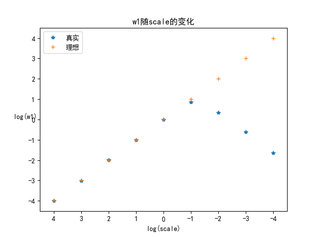
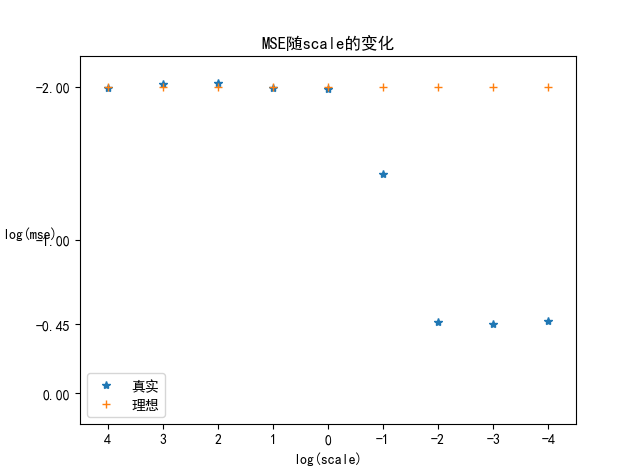
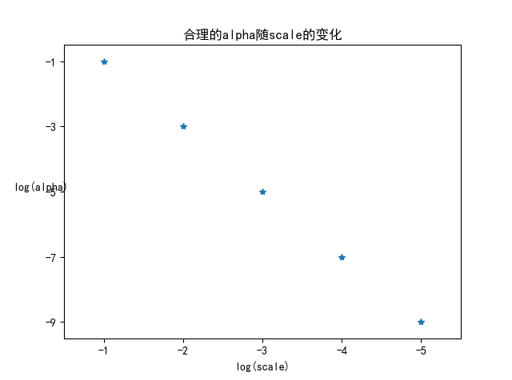

# 从正则化角度理解为什么需要特征归一化

## 1 介绍

特征归一化，更一般地称为特征放缩(Feature Scaling)，是数据预处理中的一种常用技术。那么为什么要进行特征归一化呢？总结一下主要有这些：

1. 距离敏感的算法需要归一化：在KNN，K-means等基于距离的算法中，如果各个维度的量纲差距很大，那么在计算距离时模长大的维度会支配模长小的维度，造成距离失去意义。
2. 使用梯度下降的算法需要归一化：量纲不一致时损失函数等高线是一个离心率很高的椭圆，SGD会走许多弯路；量纲基本一致时等高线接近圆形，SGD可以快速地到达中心。所以线性回归、Logistic Regression、SVM都需要进行归一化。
3. 决策树类的算法不需要归一化：因为决策树使用信息增益和基尼指数等指标进行分裂，重要的是特征的分割点位置而不是量纲，所以决策树类的算法不需要进行归一化。

今天复习SGD的时候又想到了一种新的解释，做了个小实验发现的确是这样，不知道是否已经有人发现过了，总之还是整理一下写出来吧。

## 2 直觉解释

正则化是一种常用的防止过拟合手段，最常见的L1和L2正则化，L1正则化倾向于稀疏，L2正则化倾向于平滑，岭回归、LASSO、Logistic Regression和SVM都是常见的带正则化的学习器，那么特征归一化和正则化有什么关系呢？

设想有一个特征，量纲很小但很重要，所以一个好的学习器应当赋予这个特征很大的权重；另一方面，L2正则化会惩罚过大的权重，所以一个带L2的学习器不应当赋予这个特征过大的权重。

这就引入了一组矛盾（机器学习中真是处处充满矛盾）。

下面我们将会通过一个小实验来验证这个直觉。

## 3 实验设置

任务：回归

评价指标：MSE

学习器：岭回归（MSE损失 + L2正则化）

$\min_{w} \frac{1}{n} \sum_{i=1}^n(w^Tx^{(i)} - y^{(i)})^2 + \alpha||w||_2^2 $

数据：生成1000个样本，700个用于训练，300个用于测试。

有五个特征 
$\{x_1, x_2, x_3, x_4, x_5\}$
，其中 
$\{x_2, x_3, x_4, x_5\}$
都是区间 
$[-1, 1]$
上均匀分布的随机数， 
$x_1$
是区间 
$[-scale, scale]$
上均匀分布的随机数，其中 
$scale$
是我们实验中的变量。

响应变量 
$y = (1/scale) * x_1 + N(0,0.1^2)$
，即除去一个标准差为0.1的高斯噪声外， 
$y$
只与 
$x_1$
有关。

说明：可以看出，无论 
$scale$
取什么值， 
$y$
的范围都落在区间 
$[-1, 1]$
内（严格来说由于噪声的存在会超出一些），从而岭回归的误差函数项也都具有同样的量纲，所以在不同的实验设置中 
$\alpha$
项的含义相同。在理想情况下，权重 
$w_1 = 1/scale$
，MSE = 0.01，即误差仅由高斯噪声产生。

## 4 实验结果
固定岭回归中的 
$\alpha=1$
，在范围 
$[10^{4}, 10^{-4}]$
内改变 
$scale$
的数量级，得到的 
$w_1$
的变化如下图：

可以看出，当 
$scale = 10000, 1000, 100, 10, 1$
时，由于真实的 
$w_1$
数量级较小，L2正则化项不会使得权值大幅衰减，可以得到对 
$w_1$
的精确拟合；当 
$scale = 0.1$
时，真实的 
$w_1=10$
，L2正则化开始使得权值衰减，无法精确拟合；当 
$scale$
的数量级继续减小时， 
$w_1$
迅速增大，L2正则化的影响也迅速增大，造成拟合越来越不精确。

MSE的变化如下图：

可以看出，当 
$scale = 10000, 1000, 100, 10, 1$
时，MSE = 0.01，恰好是我们添加的高斯噪声的方差，可以认为岭回归完美拟合了数据集；当 
$scale = 0.1$
时，测试误差开始增大；当 
$scale$
小于等于0.01时，测试误差趋于稳定，数值大约在 
$10^{-0.45} \approx 0.35$
附近，而测试集上的响应变量的方差也在0.35附近，这说明模型给出的结果与随机猜测无异。

从上面的实验我们可以得到结论：在正则化系数不变的情况下，关键特征的数量级越小，模型的学习效果越差。

下面我们来验证在关键特征的数量级过小的情况下，减小正则化系数是否可以改善模型效果。

对于范围 
$[10^{-1}, 10^{-5}]$
范围内的 
$scale$
，我们来看多大的 
$\alpha$
是合理的。我们对合理的定义为：得到的 
$w_1$
与真实的 
$w_1$
相差不超过5%，结果如下图（粗略结果）：

可以看出，
$scale$
每减小一个数量级， 
$\alpha $
就需要减小两个数量级，这是十分符合直觉的：岭回归的L2正则化项为 
$\alpha||w||_2^2$
, 
$scale$
减小一个数量级意味着 
$w$
增加两个数量级，为了使正则化损失不变， 
$\alpha $
就需要减小两个数量级。

## 5 总结

当关键特征的数量级较小时，正则化项可能会使得模型失效。虽然可以通过减小正则化系数来缓解这一现象，但是过小的正则化系数可能会使得模型在其他特征上过拟合，这样的矛盾使得我们很难选取到合适的正则化系数。

在学习之前，我们不知道哪些特征是关键特征，也就不知道是否应当倾向于选择更小的正则化系数。这时，对特征进行归一化也就理所应当了。

