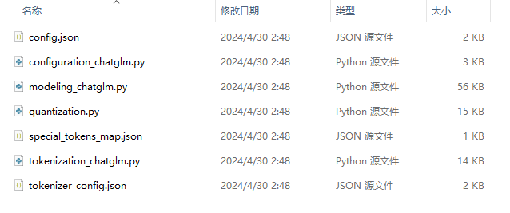
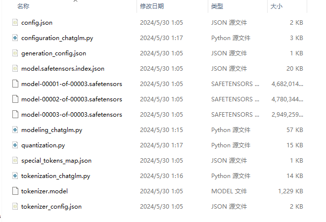

# 日语大模型ChatGLM3-Japanese：（一）扩词表

最近在学习大模型，想要通过一个自己的项目来加深理解。目前的个人项目主要分为两种：一种是开源LLM在垂直领域的微调，另一种是1B以下小模型的从零训练。除此之外，还有一些项目是扩充语种，因为我比较喜欢日语，并且扩充语种项目大都需要自己训练tokenizer，能更完整地体验流程，就打算训练一个中日双语的ChatGLM3-6B（或者说是中英日三语），称之为ChatGLM3-Japanese。

HuggingFace链接：

- [ChatGLM3-Japanese-Zero](huggingface.co/dummy-foo/ChatGLM3-Japanese-Zero)：扩词表但未经训练的，完全保留了原生ChatGLM3的中英文能力，且日文编码效率几乎翻倍，适合用来做日文语料的训练。

- [ChatGLM3-Japanese](​huggingface.co/dummy-foo/ChatGLM3-Japanese)：经过日文语料增量预训练和指令微调的。

对我有启发的三个项目：

- [LLaMA-Factory](https://github.com/hiyouga/LLaMA-Factory)：LLM训练框架（虽然名字叫LLaMA但是支持很多LLM），主要使用其训练模型。
- [Chinese-LLaMA-Alpaca](https://github.com/ymcui/Chinese-LLaMA-Alpaca)：中文LLaMA浪潮中最著名的一个，主要参考其训练思路：扩词表——增量预训练——指令微调，以及合并tokenizer的方式。
- [nekomata-7b](https://huggingface.co/rinna/nekomata-7b)：日本LLM公司微调通义千问Qwen-7B得到的模型，似乎没有开源代码，并且因为Qwen的词表本身很大（15万），这个项目也没有再扩词表，实质性的参考有限，主要的启发点在于知道了中文LLM扩充日文是可行的

ChatGLM3-Japanese项目分为两部分：扩词表 + 训练，训练又包括增量预训练和指令微调。这篇记录扩词表部分，训练部分在下一篇中。

【2024-06-05更新】：[GLM-4-9B](https://github.com/THUDM/GLM-4)发布了，原生支持日语等二十多种语言，我自己测了一下发现效果还是很不错的，词表有15万，很少会出现直接把简体汉字词拿来当作日语词的现象了，生产环境有日语需求的可以考虑用一下。不过我认为ChatGLM3-6B还是有很大价值的，如果是为了学习而不是生产，它是一个非常好的选择，我把它当作精学的第一个大模型的原因就是它是很良心的6B，只需要约12.5GB的显存即可运行，考虑到除了4090(D)以外的消费级显卡最大也只有16G，它无疑是最适合在自家电脑单步调试、魔改、学习炼丹知识的大模型。在不量化的情况下，8B无法在16G的显卡上推理，7B可以推理但是很难微调，而6B的ChatGLM3是可以完全无压力在16G显卡上LoRA微调的。

## 1 使用sentencepiece训练日文tokenizer

[ChatGLM3](https://github.com/THUDM/ChatGLM3)是中英双语模型，词表大小为65024（64789个有效），已经覆盖了大多数日文单词，但是对日文的压缩率很差，每个假名都会被分为单独的token，ぬ甚至会被分为3个token。

```python
tokenizer.tokenize('あいうえおかきくけこ')
['▁', 'あ', 'い', 'う', 'え', 'お', 'か', 'き', 'く', 'け', 'こ']
tokenizer.tokenize('さしすせそたちつてと')
['▁', 'さ', 'し', 'す', 'せ', 'そ', 'た', 'ち', 'つ', 'て', 'と']
tokenizer.tokenize('なにぬねのはひふへほ')
['▁', 'な', 'に', '<0xE3>', '<0x81>', '<0xAC>', 'ね', 'の', 'は', 'ひ', 'ふ', 'へ', 'ほ']
tokenizer.tokenize('まみむめもらりるれろ')
['▁', 'ま', 'み', 'む', 'め', 'も', 'ら', 'り', 'る', 'れ', 'ろ']
tokenizer.tokenize('やゆよわをん')
['▁', 'や', 'ゆ', 'よ', 'わ', 'を', 'ん']
```

日语中的几个去掉也不影响句子意思的经典废话“させてくださいませんか”和“てもよろしいでしょうか”也都被逐字拆解，这样无论是训练还是推理的效率都很低

```python
tokenizer.tokenize('拝借させてくださいませんか')
['▁', '拝', '借', 'さ', 'せ', 'て', 'く', 'だ', 'さ', 'い', 'ま', 'せ', 'ん', 'か']
tokenizer.tokenize('読んでもよろしいでしょうか')
['▁', '読', 'ん', 'で', 'も', 'よ', 'ろ', 'し', 'い', 'で', 'し', 'ょ', 'う', 'か']
```

我们使用日文wiki和青空文库两个数据集来训练tokenizer，约有1GB日文语料，前者主要提供“正规”的日文格式，后者主要为了通过文学作品来提供更丰富的表达方式。两者配比约为4 : 1，这个配比是考虑到青空文库是几十年甚至几百年前的文章，与当代的日语有一些差异，所以以日文wiki为主，青空文库为辅。

两个数据集都来自huggingface，链接如下：

- 日文wiki：[izumi-lab/wikipedia-ja-20230720 · Datasets at Hugging Face](https://huggingface.co/datasets/izumi-lab/wikipedia-ja-20230720)，只下载第0个part，完成后改名为hf_izumi-lab_wikipedia-ja-20230720_part0.parquet放入data_for_tokenizer文件夹内。转为txt后有861M。
- 青空文库：[globis-university/aozorabunko-clean · Datasets at Hugging Face](https://huggingface.co/datasets/globis-university/aozorabunko-clean)，下载整个[aozorabunko-dedupe-clean.jsonl.gz](https://huggingface.co/datasets/globis-university/aozorabunko-clean/blob/main/aozorabunko-dedupe-clean.jsonl.gz)文件，完成后改名为hf_globis-university_aozorabunko-clean.jsonl放入data_for_tokenizer文件夹内。截取前6000篇转为txt后有199M。

训练参数的配置如下，参考[吃果冻不吐果冻皮：大模型词表扩充必备工具SentencePiece](https://zhuanlan.zhihu.com/p/630696264)

```
--input={data_path_wiki},{data_path_aozora}  # 日文wiki + 青空文库作为训练集
--model_prefix=../spm_data/ja_bpe  # 输出的文件名
--vocab_size=20000  # 词表大小
--character_coverage=0.9995  # 中文和日文最好设置为0.9995，其他语言可以是1
--model_type=bpe  # 默认是unigram，一定要显式指明bpe
```

运行代码step1_train_tokenizer.py如下：（GitHub仓库中已经在data_for_tokenizer目录中存放了训练好的模型，不需要再训练了，如果想自己体验一下训练过程，要把need_to_train改为True）

```python
from constants import *
import sentencepiece as spm
import pandas as pd
import json

data_path_wiki = '../data_for_tokenizer/wiki_for_spm.txt'
data_path_aozora = '../data_for_tokenizer/aozora_for_spm.txt'

need_to_convert = True
need_to_train = False

if need_to_convert:
    # step1 wiki to text file
    df = pd.read_parquet('../data_for_tokenizer/hf_izumi-lab_wikipedia-ja-20230720_part0.parquet')
    with open(data_path_wiki, 'w', encoding='utf-8') as file:
        for text in df['text']:
            clean_text = text
            file.write(f"{clean_text}\n")
    print("wiki to text done")

    # step2 aozora to text file
    head_article_num = 6000
    with open('../data_for_tokenizer/hf_globis-university_aozorabunko-clean.jsonl', 'r', encoding='utf-8') as infile, open(data_path_aozora, 'w', encoding='utf-8') as outfile:
        for i, line in enumerate(infile):
            if i == head_article_num:
                break
            data = json.loads(line)
            clean_text = data['text']
            outfile.write(f"{clean_text}\n")
    print("aozora to text done")

if need_to_train:
    # step3 train spm
    train_cmd = f'--input={data_path_wiki},{data_path_aozora} --model_prefix=../data_for_tokenizer/ja_bpe --vocab_size=20000 --character_coverage=0.9995 --model_type=bpe'
    spm.SentencePieceTrainer.Train(train_cmd)

# step4 load and test spm
sp = spm.SentencePieceProcessor(model_file='../data_for_tokenizer/ja_bpe.model')
print(sp.encode_as_pieces('俺たちの上に太陽など無かった。いつも夜。だけど暗くはなかった。太陽に変わるものがあったから。'))
```

在我的电脑上大约2小时跑完，如果想简单测试，不希望时间太长，可以对df取head(n)以及调低head_article_num变量的大小。

上面的两句经典废话，分别被切分成了['させて', 'ください', 'ません', 'か']和['んでも', 'よろしい', 'でしょうか']，效率还是很高的。因为日文中有好几个以'拝'开头的词，但词频都不是很高，比如拝借、拝見、拝読，所以'拝借'没有被分为一个词。

```python
print(sp.encode_as_pieces('拝借させてくださいませんか'))
['▁', '拝', '借', 'させて', 'ください', 'ません', 'か']
print(sp.encode_as_pieces('読んでもよろしいでしょうか'))
['▁', '読', 'んでも', 'よろしい', 'でしょうか']
```

对《白夜行》的名台词的分词结果如下，可以看到基本都切分成了有意义的token，如'無かった'、'があった'。

```
print(sp.encode_as_pieces('俺たちの上に太陽など無かった。いつも夜。だけど暗くはなかった。太陽に変わるものがあったから。'))
['▁', '俺', 'たち', 'の上に', '太陽', 'など', '無かった', '。', 'いつも', '夜', '。', 'だけ', 'ど', '暗', 'く', 'はなかった', '。', '太陽', 'に変', 'わる', 'もの', 'があった', 'から', '。']
```

到这里，日文tokenizer就训练完成了，会得到ja_bpe.model和ja_bpe.vocab两个文件，前者是模型本体，后者是词表，查看ja_bpe.vocab的前几个词（bpe算法认为的最高频的词），发现都是最常用的语素，符合预期。

```
して	-0
った	-1
した	-2
され	-3
ある	-4
する	-5
てい	-6
から	-7
こと	-8
である	-9
ている	-10
```

## 2 合并中文和日文词表

需要合并chatglm3的原生tokenizer和上面得到的日文tokenizer，以达到高效编码中日双语的效果，运行step2_merge_tokenizer.py即可。
代码主体参考了[Chinese-LLaMA-Alpaca的merge_tokenizers.py](https://github.com/ymcui/Chinese-LLaMA-Alpaca/blob/main/scripts/merge_tokenizer/merge_tokenizers.py)，但是做了如下改动：

```python
# add 9 dummy pieces for special tokens
for dummy_piece in ['vcxv1', 'vcxv2', 'vcxv3', 'vcxv4', 'vcxv5', 'vcxv6', 'vcxv7', 'vcxv8', 'vcxv9']:
    if dummy_piece not in cn_spm_tokens_set:
        new_p = sp_pb2_model.ModelProto().SentencePiece()
        new_p.piece = dummy_piece
        new_p.score = 0
        cn_spm.pieces.append(new_p)
    else:
        assert False
```

这段代码的含义是，在向cn_spm中插入ja_spm之前，要先插入9个无意义的pieces，这与chatglm3的特性有关，需要给特殊token预留位置，在后面我们会再讲到。

代码运行结束后会生成merged_tokenizer_sp和merged_tokenizer_hf两个文件夹，前者没用，后者将在下一步中使用。合并后词表大小64789 -> 78554，说明有6000多个token已经包含在了原生的词表中，主要是中文日文共享的一些汉字词。

测试新旧tokenizer对中文的分词，结果完全一致，符合预期。

```
pre tokenizer: ['▁白', '日', '依', '山', '尽', '，', '黄河', '入', '海', '流', '。', '欲', '穷', '千里', '目', '，', '更', '上一', '层楼', '。']

cur tokenizer: ['▁白', '日', '依', '山', '尽', '，', '黄河', '入', '海', '流', '。', '欲', '穷', '千里', '目', '，', '更', '上一', '层楼', '。']
```

测试新旧tokenizer对日文的分词，一段长度为127的謎のセリフ，原生tokenizer将其分为125个token，而我们的将其分为69个token，为原来的55%，大大提高了压缩率。どうして、んだろう、たくさん等词都可以正确切分，但是也出现了'ものの'这样的有歧义的切分，原文本来是'物の'的意思，但'ものの'给人的第一感觉是表示转折，不过这是模型自己从语料中学习到的切分方式，可以在后续训练中进一步理解其含义。

```
text = """どうしてこうなるんだろう…初めて、好きな人が出来た。一生ものの友だちができた。嬉しいことが二つ重なって、
その二つの嬉しさが、また、たくさんの嬉しさを連れてきてくれて。夢のように幸せな時間を手に入れたはずなのに…なのに、どうして、こうなっちゃうんだろう…"""

pre tokenizer, len=125: ['▁', 'ど', 'う', 'し', 'て', 'こ', 'う', 'な', 'る', 'ん', 'だ', 'ろ', 'う', '…', '初', 'め', 'て', '、', '好', 'き', 'な', '人', 'が', '出来', 'た', '。', '一生', 'も', 'の', 'の', '友', 'だ', 'ち', 'が', 'で', 'き', 'た', '。', '嬉', 'し', 'い', 'こ', 'と', 'が', '二', 'つ', '重', 'な', 'っ', 'て', '、', '<0x0A>', 'そ', 'の', '二', 'つ', 'の', '嬉', 'し', 'さ', 'が', '、', 'ま', 'た', '、', 'た', 'く', 'さ', 'ん', 'の', '嬉', 'し', 'さ', 'を', '連', 'れ', 'て', 'き', 'て', 'く', 'れ', 'て', '。', '夢', 'の', 'よ', 'う', 'に', '幸', 'せ', 'な', '時間', 'を', '手', 'に', '入', 'れ', 'た', 'は', 'ず', 'な', 'の', 'に', '…', 'な', 'の', 'に', '、', 'ど', 'う', 'し', 'て', '、', 'こ', 'う', 'な', 'っ', 'ち', 'ゃ', 'う', 'ん', 'だ', 'ろ', 'う', '…']

cur tokenizer, len=69: ['▁', 'どうして', 'こう', 'なる', 'んだろう', '…', '初めて', '、', '好きな', '人が', '出来た', '。', '一生', 'ものの', '友', 'だち', 'が でき', 'た', '。', '嬉', 'しい', 'ことが', '二つ', '重な', 'って', '、', '<0x0A>', 'その', '二つの', '嬉', 'しさ', 'が', '、', 'また', '、', 'たくさん', 'の', '嬉', 'しさ', 'を連れて', 'きて', 'くれ', 'て', '。', '夢', 'のよ', 'う', 'に', '幸', 'せ', 'な', '時間を', '手に', '入れた', 'はず', 'なの', 'に', '…', 'なの', 'に', '、', 'どうして', '、', 'こう', 'な', 'っちゃ', 'うん', 'だろう', '…']
```

## 3 调整模型代码和配置

注意，GitHub仓库中的CHATGLM_RESIZED_CODE_DIR已经是处理好了的，不需要再做本章的操作了，仅用于记录过程。

有了tokenizer之后还需要将其和模型适配，保证transformers的AutoXXX类可用。

首先把chatglm3-6b原始文件夹内除模型文件（*.bin、*.safetensors、*.index.json）和tokenizer.model以外的文件（为了方便，GitHub仓库中已经预先提取好放在CHATGLM_ORIGIN_CODE_DIR内了）都复制到自己建的空文件夹CHATGLM_RESIZED_CODE_DIR内，如下图所示。



然后需要进行三个更改：

### 3.1 移动tokenizer.model文件

将merged_tokenizer_hf文件夹下的tokenizer.model复制到CHATGLM_RESIZED_CODE_DIR文件夹内，注意其他文件如special_tokens_map.json和tokenizer_config.json不要复制。

### 3.2 修改tokenization_chatglm.py源码

原生仓库中第27-35行的源码为

```python
role_special_tokens = ["<|system|>", "<|user|>", "<|assistant|>", "<|observation|>"]
special_tokens = ["[MASK]", "[gMASK]", "[sMASK]", "sop", "eop"] + role_special_tokens
self.special_tokens = {}
self.index_special_tokens = {}
for token in special_tokens:
    self.special_tokens[token] = self.n_words
    self.index_special_tokens[self.n_words] = token
    self.n_words += 1
self.role_special_token_expression = "|".join([re.escape(token) for token in special_tokens]) # for apply_chat_template
```

这段代码的含义是：chatglm3有9个特殊token，在加载完sentencepiece的词表后，要在末尾添加这9个token，在原生模型中，它们的id是64789 - 63797，打印tokenizer的词表的末尾：

```
[('fx', 64786), ('▁fmt', 64787), ('▁attr', 64788), 
('[MASK]', 64789), ('[gMASK]', 64790), ('[sMASK]', 64791), 
('sop', 64792), ('eop', 64793), ('<|system|>', 64794), 
('<|user|>', 64795), ('<|assistant|>', 64796), ('<|observation|>', 64797)]
```

可以看到原生chatglm3的sp词表中最后一个单词是('▁attr', 64788)，后面添加了9个特殊token。

我们新sentencepiece词表的末尾是下面这些：

```
[('塲', 78542), ('嬶', 78543), ('軻', 78544), 
('笊', 78545), ('獰', 78546), ('瑳', 78547), 
('ぅ', 78548), ('彅', 78549), ('ぉ', 78550), 
('巓', 78551), ('弉', 78552), ('燗', 78553)]
```

如果使用原生的代码，9个特殊token的id会变成78554 - 78562，如果是从零开始训练模型，这样一点问题都没有，但我们希望能在原生chatglm3的基础上进行增量预训练和微调，需要保持一些它原有的能力，如果改了这9个特殊token的id，原生模型的判断句子首尾、对话开始结束的能力将会完全丧失，这是我们不想看到的，所以需要保持9个特殊token的id仍然是64789 - 64797，这就是在上一个步骤中预留9个dummy_piece的原因。将CHATGLM_RESIZED_CODE_DIR文件夹内tokenization_chatglm.py的源码的27-35行替换为下面这一段：

```python
role_special_tokens = ["<|system|>", "<|user|>", "<|assistant|>", "<|observation|>"]
special_tokens = ["[MASK]", "[gMASK]", "[sMASK]", "sop", "eop"] + role_special_tokens
self.special_tokens = {}
self.index_special_tokens = {}
special_token_start_idx = 64789  # original start idx of special token
for token in special_tokens:
    self.special_tokens[token] = special_token_start_idx
    self.index_special_tokens[special_token_start_idx] = token
    special_token_start_idx += 1
self.role_special_token_expression = "|".join([re.escape(token) for token in special_tokens]) # for apply_chat_template
```

新的tokenizer的词表含有下面这些，可以看到，9个特殊token仍然跟在('▁attr', 64788)后面，且id为64789 - 64797，与原生保持一致。我们的sentencepiece中的单词紧跟其后从64798开始。

```
[('fx', 64786), ('▁fmt', 64787), ('▁attr', 64788), 
('[MASK]', 64789), ('[gMASK]', 64790), ('[sMASK]', 64791), 
('sop', 64792), ('eop', 64793), ('<|system|>', 64794), 
('<|user|>', 64795), ('<|assistant|>', 64796), ('<|observation|>', 64797), 
('して', 64798), ('った', 64799), ('した', 64800), 
('され', 64801), ('ある', 64802), ('する', 64803), ('てい', 64804)]
```

### 3.3 修改modeling_chatglm.py源码

在扩充词表后，模型的输入和输出embedding肯定也要修改为对应的维度，但是chatglm3的原生代码是不支持resize的，原因是transformers库的resize_token_embeddings方法要求模型必须实现get_input_embeddings()和get_output_embeddings()方法来获取词汇嵌入和输出层，但原生代码没实现（感觉还是有点奇怪的），所以我们需要自己修改代码实现它们。为CHATGLM_RESIZED_CODE_DIR文件夹内的modeling_chatglm.py文件的ChatGLMForConditionalGeneration类增加下面四个方法：

```python
def get_input_embeddings(self):  # add for resize embedding
    return self.transformer.embedding.word_embeddings

def set_input_embeddings(self, value):  # add for resize embedding
    self.transformer.embedding.word_embeddings = value

def get_output_embeddings(self):  # add for resize embedding
    return self.transformer.output_layer

def set_output_embeddings(self, value):  # add for resize embedding
    self.transformer.output_layer = value
```

## 4 得到完整的中日双语（中英日三语）模型

运行代码step3_create_resized_model.py如下，从CHATGLM_RESIZED_CODE_DIR文件夹中读取tokenizer，从原生chatglm3仓库CHATGLM_ORIGIN_MODEL_DIR中读取model，值得注意的是，ChatGLMTokenizer和ChatGLMForConditionalGeneration这两个类必须从CHATGLM_RESIZED_CODE_DIR文件夹中读取，暂时还不能使用from transformers import AutoModelForCausalLM, AutoTokenizer，因为我们要使用刚才修改过的代码来完成tokenizer的特殊token插入和model的resize_embeddings。

```python
from constants import *
import torch
from chatglm_resized_code_dir.modeling_chatglm import ChatGLMForConditionalGeneration
from chatglm_resized_code_dir.tokenization_chatglm import ChatGLMTokenizer
import shutil, glob

# load resized tokenizer
tokenizer = ChatGLMTokenizer.from_pretrained(CHATGLM_RESIZED_CODE_DIR)

# load original model
model = ChatGLMForConditionalGeneration.from_pretrained(CHATGLM_ORIGIN_MODEL_DIR, device_map='cuda:0', torch_dtype=torch.float16)

# resize model and modify config
model.resize_token_embeddings(len(tokenizer), pad_to_multiple_of=64)
model.config.padded_vocab_size = model.get_input_embeddings().weight.shape[0]
model.config.name_or_path = 'dummy-foo/chatglm3-japanese-zero'
print(f'tokenizer size: {len(tokenizer)}, pad_to_multiple_of=64, model embedding size: {model.get_input_embeddings().weight.shape}')

# save resized tokenizer and resized model to one dir
need_to_save_model = True
if need_to_save_model:
    tokenizer.save_pretrained(CHATGLM_RESIZED_MODEL_DIR)
    model.save_pretrained(CHATGLM_RESIZED_MODEL_DIR)

    files = glob.glob(f'{CHATGLM_RESIZED_CODE_DIR}/*.py')
    for file in files:
        shutil.copy(file, CHATGLM_RESIZED_MODEL_DIR)

    print(f'model saved to {CHATGLM_RESIZED_MODEL_DIR}, now you can load model with transformers.AutoXXX')
```

代码运行输出：

```
tokenizer size: 78552, pad_to_multiple_of=64, model embedding size: torch.Size([78592, 4096])
```

model和tokenizer会保存在目录CHATGLM_RESIZED_MODEL_DIR中。

代码运行还会将CHATGLM_RESIZED_CODE_DIR文件夹中的4个.py文件（tokenization_chatglm.py、modeling_chatglm.py、configuration_chatglm.py、quantization.py）复制到刚导出的CHATGLM_RESIZED_MODEL_DIR中，运行结束后效果如下：



现在，模型拥有了完整的代码和配置，可以使用AutoModelForCausalLM和AutoTokenizer来读取了。来测试一下：

```python
from constants import *
import torch
from transformers import AutoModelForCausalLM, AutoTokenizer

tokenizer = AutoTokenizer.from_pretrained(CHATGLM_RESIZED_MODEL_DIR, trust_remote_code=True)
model = AutoModelForCausalLM.from_pretrained(CHATGLM_RESIZED_MODEL_DIR, trust_remote_code=True, device_map='cuda:0', torch_dtype=torch.float16)

# test Chinese chat, 预期得到和原生模型一样的答案
response, _ = model.chat(tokenizer, "你是谁", history=[])
print("\nQ：你是谁，A：", response)
response, _ = model.chat(tokenizer, "你喜欢甜粽子还是咸粽子", history=[])
print("\nQ：你喜欢甜粽子还是咸粽子，A：", response)

# test Japanese chat, まったく無意味な答えが得られるでしょう
response, _ = model.chat(tokenizer, "あなたは誰ですか", history=[])
print("\nQ：あなたは誰ですか，A：", response)
response, _ = model.chat(tokenizer, "すみません、ちょっとお聞きしたいことがあるんですが", history=[])
print("\nQ：すみません、ちょっとお聞きしたいことがあるんですが，A：", response)

# test Japanese tokenizer
print("\ntokens: ", tokenizer.tokenize("恥の多い生涯を送って来ました。自分には、人間の生活というものが、見当つかないのです。"))
```

输出为：

```
Q：你是谁，A： 我是一个名为 ChatGLM3-6B 的人工智能助手，是基于清华大学 KEG 实验室和智谱 AI 公司于 2023 年共同训练的语言模型开发的。我的任务是针对用户的问题和要 求提供适当的答复和支持。

Q：你喜欢甜粽子还是咸粽子，A： 作为一个人工智能助手，我没有口味和个人喜好。但我可以帮助您了解甜粽子和咸粽子的一些特点。

甜粽子通常以糯米、红枣、莲蓉等甜馅为主，口感甜腻，适合喜欢甜食的人。
咸粽子则以糯米、肉、蛋黄等咸馅为主，口感咸鲜，适合喜欢重口味的人。

您可以根据自己的口味和喜好尝试一下甜粽子和咸粽子，看看哪种更适合您。

Q：あなたは誰ですか，A： 抱歉，我不太明白您的问题。能否请您提供更多上下文或信息，以便我更好地理解您的问题？

Q：すみません、ちょっとお聞きしたいことがあるんですが，A： 这句话看起来像是日语和英语混杂的语言，其中“おいしました”的意思是“很好吃”，“红色的”则明确指出了事物的 颜色。因此，这句话的意思可能是“这很红，很好吃”，但这种表达方式并不常见。如果你想表达“这很红，很好吃”，可以用英语的“This is very red and delicious”来表达。

tokens:  ['▁', '恥', 'の多い', '生涯', 'を送', 'って', '来ました', '。', '自分に', 'は', '、', '人間の', '生活', 'というもの', 'が', '、', '見', '当', 'つかない', 'のです', '。']
```

可以看到，中文对话能力没有受到影响，因为我们中文字符还是会被tokenizer分在id=64788以前，而这部分的模型embedding是没变的，但是日文对话能力几乎完全丧失，因为大概率会被tokenizer分在id=64798以后，这部分的模型embedding是随机初始化的，无意义的。

但是，由于日文tokenizer的压缩率有了接近一倍的提升，模型对日文的学习将会更有效率，下一步我们就来使用这个模型进行日文语料的增量预训练 + 指令微调，使其具备日文对话能力。