# 日语大模型ChatGLM3-Japanese：（二）模型训练

在扩完日语词表、合并tokenizer之后，就该开始训练模型了。因为日语都会被tokenizer编码到原生词表之后的id，模型完全不知道这些id的含义，所以我们要从零开始给模型赋予日语能力。

按照目前比较流行的观点，模型的知识主要是在预训练阶段注入的，指令微调主要是让模型学习怎么说话，后面的RLHF主要是对齐人类的偏好。ChatGLM3-Japanese-Zero模型是完全没有日语知识的，所以我们有必要进行预训练；指令微调也是必须做的，因为预训练后的模型其实只是一个扩写器甚至复读机，不具备对话能力；RLHF本文没有进行，对于这类不需要上生产环境的模型，似乎不是必需品。所以，接下来就会按照增量预训练 + 指令微调的步骤来继续介绍。

HuggingFace链接：

- [ChatGLM3-Japanese-Zero](huggingface.co/dummy-foo/ChatGLM3-Japanese-Zero)：扩词表但未经训练的，完全保留了原生ChatGLM3的中英文能力，且日文编码效率几乎翻倍，适合用来做日文语料的训练。

- [ChatGLM3-Japanese](​huggingface.co/dummy-foo/ChatGLM3-Japanese)：经过日文语料增量预训练和指令微调的。

## 1 数据集

### 1.1 增量预训练数据集

共使用了5GB文本文件，约1B tokens来对扩充词表后的模型进行增量预训练，日文、中文、英文占比分别约76%、12%、12%，数据集详细介绍如下：

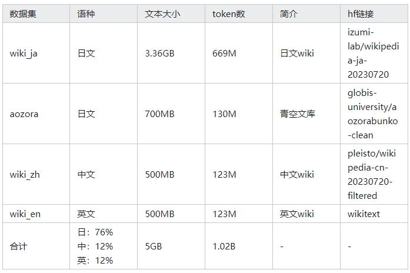

关于不同语言的数据配比，Chinese-LLama采用了中文 : 英文 = 1 : 1，但是考虑到我没有这么多计算资源，希望能提升日语语料的占比。参考了一个日语大模型的博客[swallow-llama](https://tokyotech-llm.github.io/swallow-llama)

> そこで、研究チームではLlama 2の7B, 13B, 70Bのモデルをベースに、大規模な日本語ウェブコーパスと英語のコーパスを9:1で混ぜたデータで継続事前学習を行い、元々の言語モデルの能力を活かしながら日本語能力の改善を目指しました。

Swallow使用的配比是日文 : 英文 = 9 : 1，得到的效果是：

> 続いて、英語の性能を示します。Swallowの英語の性能は元のモデルよりも若干低下しています。Swallowでは継続事前学習に日本語と英語のテキストを混ぜたデータを利用していますが、他のモデルでよく用いられる混合比1:1ではなく、日本語を重視した9:1を採用しています。これが英語の性能低下に繋がったのかどうかは、今後の追加実験で明らかにしていく予定です。

Swallow的日文能力很强，但英文能力不好，作者怀疑可能有这个数据配比的原因。所以，我们采取一个折中的方案，日文 : 其他 = 3 : 1，然后其他语言里中文 : 英文 = 1 : 1。

### 1.2 指令微调数据集

共使用了22万条指令数据集对增量预训练后的模型进行微调，日文、中文、英文、代码占比分别约52%、22%、9%、17%，数据集详细介绍如下：

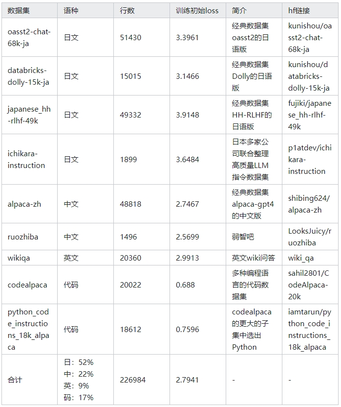

表格中还给出了训练开始时每个子数据集的loss大小（只指定单个数据集运行然后记录指标），大致可以说明数据集的难度，可以看到平均loss是2.79，日文数据集loss都大于3，中文英文数据集loss都小于3，因为ChatGLM3是在大量中文英文上预训练过的，日文只过了1B tokens，所以这个结果是符合预期的。有意思的是代码数据集的loss甚至不到1，这个和我的直觉相反，我一直以为写代码对LLM是很难的任务，看来它的难度远远低于自然语言，大概是因为代码的符号集比较小，每种语言的关键词都是确定的几十种，变量名也很容易从上文推断出来，所以总得来说，LLM写代码不是非常难的任务，比较容易预测下一个token。

## 2 增量预训练（失败版）

训练使用[LLaMA-Factory](https://github.com/hiyouga/LLaMA-Factory)框架，考虑到pip安装这个显得有些太重了，就直接把它的源码部分复制到代码仓库里了【详见GitHub仓库】，这样打断点写注释也更方便一些。

第一次增量预训练以失败告终，花了大量GPU时买来的教训！！！也记录一下给后人避坑。
参考[Chinese-LLaMA-Alpaca](https://github.com/ymcui/Chinese-LLaMA-Alpaca)最早的做法，将增量预训练分为两个步骤：step1冻结transformer部分，全参训练embedding层；step2用lora来训练transformer。我一开始也选择了这个路线，但实际上原作者在仓库里也说了这种做法事后证明并不好，step1的收敛非常慢，更好的方式是直接在lora训练transformer的同时全参训练embedding，也就是合二为一。我看到了这个提醒，但是以为没有那么严重，一开始还是选择了这个方案。。。

### 2.1 冻结transformer只训练embedding

直接来看loss图，训练loss从一开始的8降到了3.75，测试loss最终3.8左右。起始loss为8是合理的，其他人在给Llama模型添加中文能力时也观测到此现象，所以我猜LLM对于没见过的语言，起始训练loss大约为8。

起始loss很正常，但是结束的loss有问题。在小模型时代，比如打个kaggle什么的，这样的loss可以说收敛得挺不错，但是在大模型时代，讲究一个幂律分布，这种loss只能说远远远远没到收敛的状态。

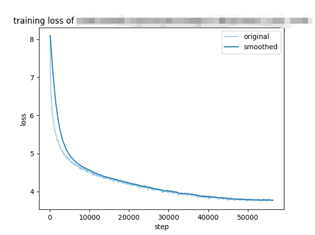

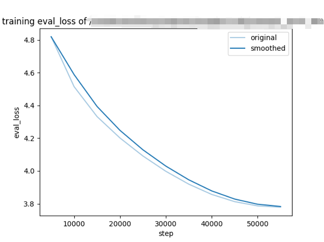

### 2.2 只训练transformer

这一步是在刚才的模型的基础上预训练的，训练loss大约从4.5降到了3.2，测试loss最终也是3.2左右。和上面一样的问题，这个loss图一看就没收敛。

经过这两个步骤的增量预训练，loss还在3.2左右，这时候我已经觉得不妙了，拿这个模型测试了一下，果然模型对日语理解很不好，几乎完全是已读乱回。这种训练方式真的收敛很慢，不要分开训练了。

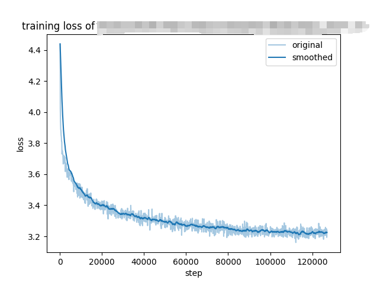

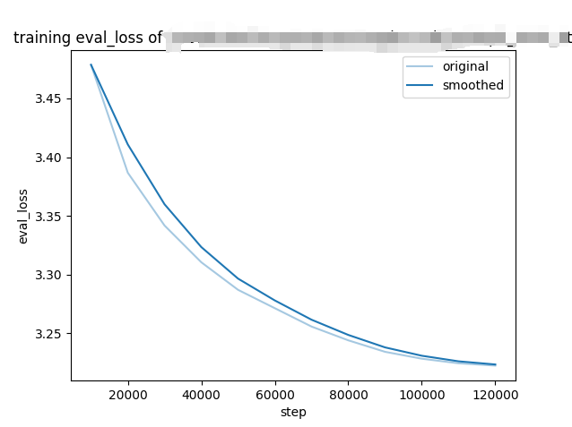

## 3 增量预训练（成功版）

单卡代码，py文件比sh文件更好debug，适合单卡调试代码：https://github.com/akiragy/ChatGLM3-Japanese/blob/main/step5_train_pt_single_gpu.py

多卡代码，py文件很难启动多卡训练，所以用torchrun来运行：https://github.com/akiragy/ChatGLM3-Japanese/blob/main/step5_train_pt_multi_gpu.sh

在lora训练transformer的同时，全参训练输入输出embedding。使用deepseed开zero2，在4张4090上训练了约60小时，训练loss约从7降到2.7，测试loss最终也是2.7左右，这个loss图看起来收敛情况就好多了，尾部比上面的几个图都要长，比较像幂律分布的形状了，算是基本榨干了1B tokens，如果想要更好的效果，需要加数据了。

跑了几百steps简单测试了下，在2张4090上训练的预估时间在120小时左右，所以在显存充足的情况下，开zero2，哪怕是4090这种PCI-E显卡，也可以获得线性加速比。

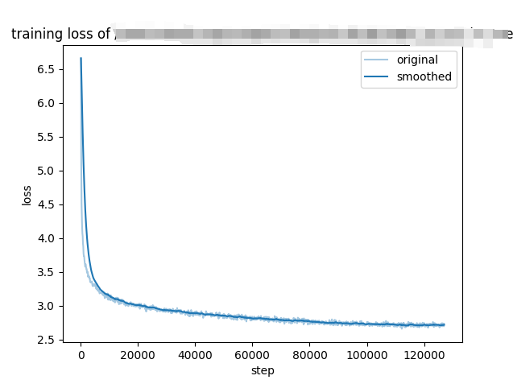

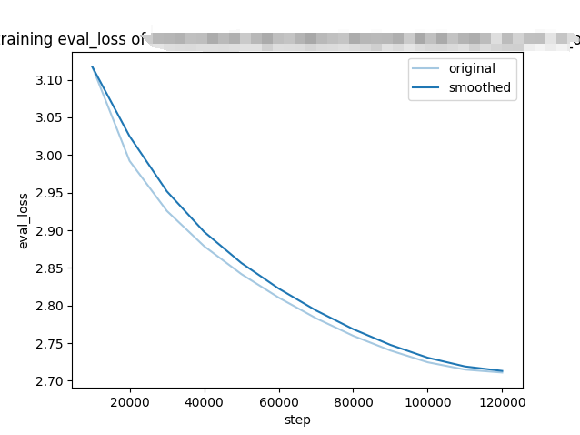

## 4 指令微调

单卡代码，py文件比sh文件更好debug，适合单卡调试代码：https://github.com/akiragy/ChatGLM3-Japanese/blob/main/step6_train_sft_single_gpu.py

多卡代码，py文件很难启动多卡训练，所以用torchrun来运行：https://github.com/akiragy/ChatGLM3-Japanese/blob/main/step6_train_sft_multi_gpu.sh

只lora训练transformer部分，embedding保持不变。使用deepseed开zero2，1个epoch，在4张4090上训练了约4.5小时，训练loss约从2.4降到1.75，测试loss最终是1.78左右。这个loss看起来收敛也不是太好，但是日语开源的指令微调语料太少了，高质量的更少，目前精力有限也没法通过chatgpt来自制数据，所以就先使用手头数据训练这一版了。

跑了几百steps简单测试了下，在2张4090上预估9小时，符合线性加速比。在2张3090上也是约9小时，居然和4090一样快，说明瓶颈并非在计算能力，而是受限于IO，查看显卡状态发现训练过程中4090平均负载只有55%左右，所以拿4090训练有点浪费了。

为什么预训练部分4090满载，指令微调部分只能55%呢。因为预训练部分会把语料切分、填满max_seq_len，比如最长1024，当前文章长度只有800个token的话，就加入一个类似<sep>的分割符然后把下一篇文章的前223个token拿来放在当前batch，下一篇文章的剩余部分作为下一个batch的起始。这样能保证每个batch都最大限度塞入了语料，不需要做padding，GPU可以满载运行，达到最大化利用率。然而在指令微调部分，对话长度参差不齐，也不能把不同的对话强行拼接在一起，GPU就只能有一搭没一搭工作了。

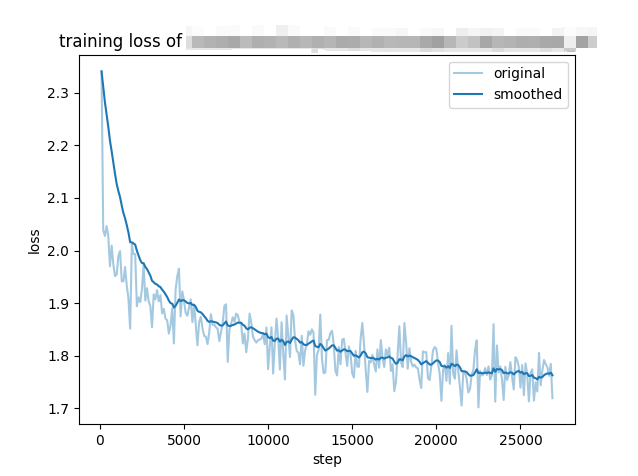

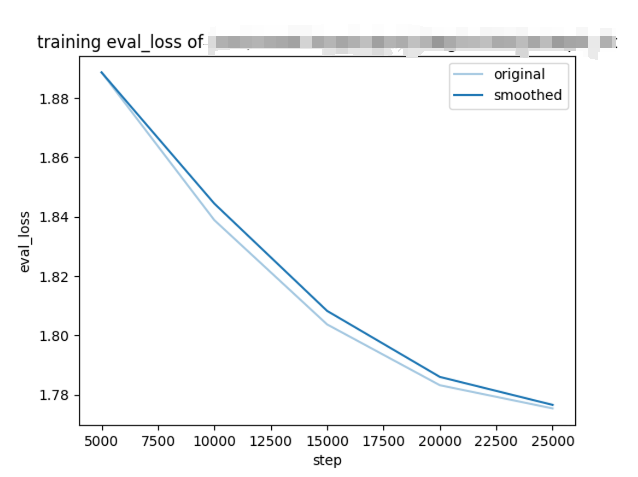

因为感觉收敛不太好，又尝试了一下加到2个epoch，训练loss在第2个epoch开始的位置有一个断崖式下降，这是过拟合的表现，原因是学习率太高，亲测如果把学习率调低一些就不会有这个断崖了。但是考虑到测试loss没有上升，说明这个程度的过拟合是没有大问题的，还不需要降学习率。最终测试loss在1.72左右，低于1个epoch的1.78。

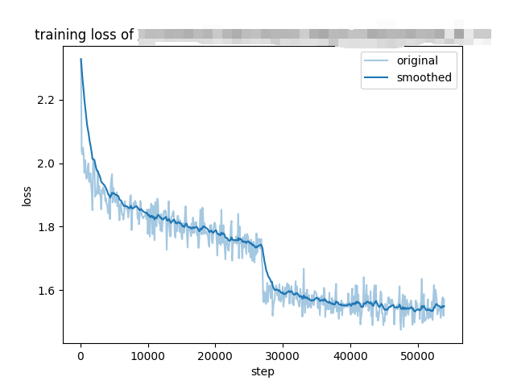

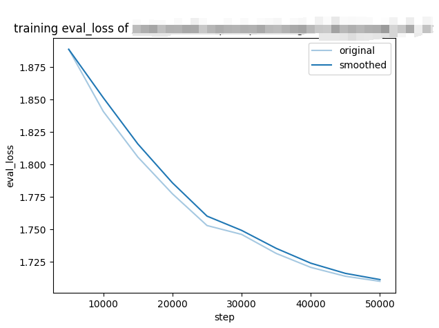

还尝试了在lora训练的同时也训练embedding，也就是和增量预训练相同的方式，训练1个epoch，在2张3090上需要20小时，相对仅lora的时间翻了一倍，太费卡了。。。但是loss收敛好一些，训练loss最终1.65，低于仅lora的1.75；测试loss最终1.68，低于仅lora的1.78，也低于2个epoch的仅lora，两者的训练时间也差不多。经过对比测试，最终选择了这个版本。

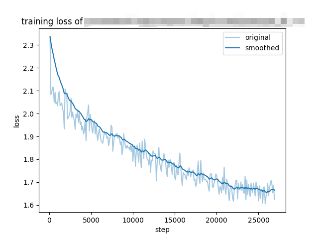

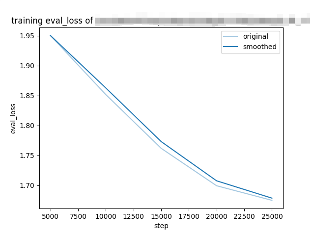

## 5 测试

问了在上一篇中问过的几个问题，又追加了几个指令数据集中的问题。

```python
from constants import *
import torch
from transformers import AutoModelForCausalLM, AutoTokenizer

tokenizer = AutoTokenizer.from_pretrained(CHATGLM_RESIZED_MODEL_DIR, trust_remote_code=True)
model = AutoModelForCausalLM.from_pretrained(CHATGLM_RESIZED_MODEL_DIR, trust_remote_code=True, device_map='cuda:0', torch_dtype=torch.float16)

# test Chinese chat, 预期得到和原生模型一样的答案
response, _ = model.chat(tokenizer, "你是谁", history=[])
print("\nQ：你是谁，A：", response)
response, _ = model.chat(tokenizer, "你喜欢甜粽子还是咸粽子", history=[])
print("\nQ：你喜欢甜粽子还是咸粽子，A：", response)

# test Japanese chat, まったく無意味な答えが得られるでしょう
response, _ = model.chat(tokenizer, "あなたは誰ですか", history=[])
print("\nQ：あなたは誰ですか，A：", response)
response, _ = model.chat(tokenizer, "すみません、ちょっとお聞きしたいことがあるんですが", history=[])
print("\nQ：すみません、ちょっとお聞きしたいことがあるんですが，A：", response)

def do_qa(inputs):
    response, _ = model.chat(tokenizer, inputs, history=[])
    print(f"\nQ：{inputs}，A：", response)

do_qa("ゲーム開発者になるために学ぶべきことのステップを教えてください。")
do_qa("長編映画とはどのようなものですか")

do_qa("魚の種類はどっち？イコクエイラクブカとロープ")
do_qa("ラクダはなぜ水なしで長く生きられるのか？")

# test Japanese tokenizer
print("\ntokens: ", tokenizer.tokenize("恥の多い生涯を送って来ました。自分には、人間の生活というものが、見当つかないのです。"))
```

回答基本正确，但可以看出有一些复读机现象，比如「また、ゲームデザイン、ゲームプログラミング、グラフィックデザインなどのゲーム制作に必要な技術も学ぶ必要があります。」重复了两遍，不过好在没有死循环，而是跳了出来，使用「最後に、ゲームのデザインやプログラミング方法についての専門知識を持つことが重要です。」这个比较正常的结尾。语言上没有大问题，但是内容还是有点问题，所以这个模型增量预训练部分学得不错，但是指令微调部分效果一般。现在huggingface放出来的日文指令数据集大都是英文的直译版本，我肉眼检查了一下发现了有很多错译，真正的原生日文指令只有ichikara-instruction里的几千个，数据还是不太够的，所以想要训练一个表现更好的日文大模型，重点在于高质量的日文指令数据集。日文的LLM社区远远没有中文活跃，现阶段个人开发者很难收集到这样的数据，需要企业花费专门的人力去做。

```
Q：你是谁，A： 我是一个人工智能助手，我的目的是通过我的编程来帮助人类解决问题。

Q：你喜欢甜粽子还是咸粽子，A： 作为一个人工智能助手，我并没有个人喜好。但我可以根据你的喜好为你提供信息。

Q：あなたは誰ですか，A： 私はオープンソースの言語モデル、オープンアシスタントです。

Q：すみません、ちょっとお聞きしたいことがあるんですが，A： 問題ありません。ご質問は何ですか？

Q：ゲーム開発者になるために学ぶべきことのステップを教えてください。，A： ゲーム開発者になるために、まずプログラミングの基本を学ぶ必要があります。また、ゲームデザイン、ゲームプログラミング、グラフィックデザインなどのゲーム制作に必要な技術も学ぶ必要があります。また、ゲームデザイン、ゲームプログラミング、グラフィックデザインなどのゲーム制作に必要な技術も学ぶ必要があります。さらに、ゲームのアイデアやデザインを作成し、そのゲームをプログラムする。また、プログラミング言語、ゲームエンジン、その他の開発ツールなどのテクノロジーの知識も必要です。最後に、ゲームのデザインやプログラミング方法についての専門知識を持つことが重要です。

Q：長編映画とはどのようなものですか，A： 長編映画は、通常60分以上、長さが1時間半以上の映画です。

Q：魚の種類はどっち？イコクエイラクブカとロープ，A： イコクエイラクブカ

Q：ラクダはなぜ水なしで長く生きられるのか？，A： まあ、ラクダは、水なしで数ヶ月生きることができる。ラクダは、脂肪が多ければ多いほど、水なしで長生きすることができる。ラクダは、水なしで数ヶ月生きることができる。ラクダは、水なしで長生きすることができる。
```

这个项目到此就结束了，总结一下每个步骤的知识点：
- 训练日文tokenizer：sentencepiece的使用，从语料中用bpe无监督学习tokenizer
- 合并原生和日文tokenizer：合并时要注意ChatGLM3词表末尾的9个特殊token，不要覆盖它们
- 调整模型输入输出层大小：ChatGLM3原生没有重载这两个方法，需要手动修改源码
- 增量预训练：LoRA训练transformer和全参训练embedding最好同时进行，体会一下幂律分布的强大
- 指令微调：数据、数据、数据